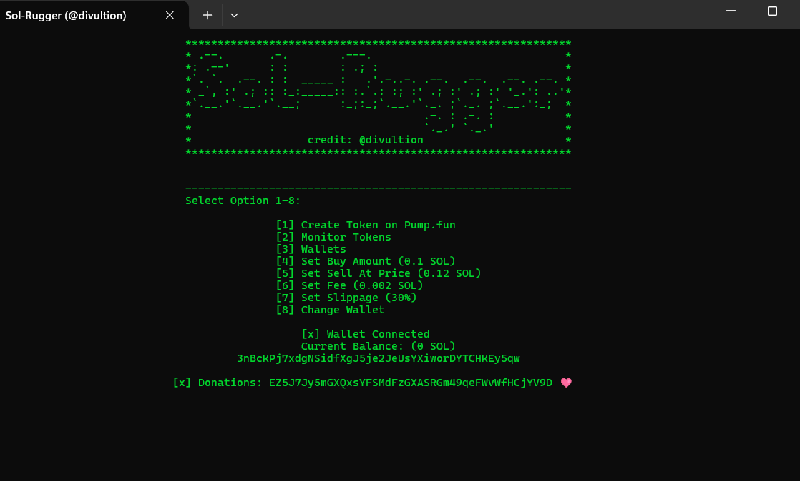

# Solana Rug Pull Bot
This Solana Rug Pull Bot is a feature-rich solution tailored for individuals looking to exploit Pump.fun user's trust effortlessly. Whether you're looking to just launch a coin or rug it.

## Features

### Create Token on Pump.fun:
Creates Token on Pump.fun using your settings/links and sell limit.

### Monitor Tokens:
Listens for buys/sells and rugs itself when sell limit is reached.

### Wallets:
You can create dev wallets here which you use to buy/sell tokens so users trust this token.

## Set Up:
Just launch the executable and enter your wallet

## Customization Options
This bot is fully customizable to meet your business needs. Whether you require additional features, specific integrations, or design adjustments, we can tailor the bot to your requirements. Contact us to discuss your unique needs.

## How to Get Started
If you’re interested in purchasing this bot or discussing customization options, please reach out to us directly. We’ll guide you through the setup process and ensure the bot is perfectly suited to your business.

<a href="https://t.me/iamnyzen">TG</a>: iamnyzen 

<b>Reach me on Telegram at @iamnyzen. I do not conduct business anywhere else.
Please share the details of your project, and I'll provide a quote and timeline once I have a clear understanding of its scope.
There’s no pressure to proceed with my services after we’ve discussed your project. I won’t consider you a ‘time-waster’ if you decide not to move forward. Offering consultations and quotes is simply part of my job.</b>
